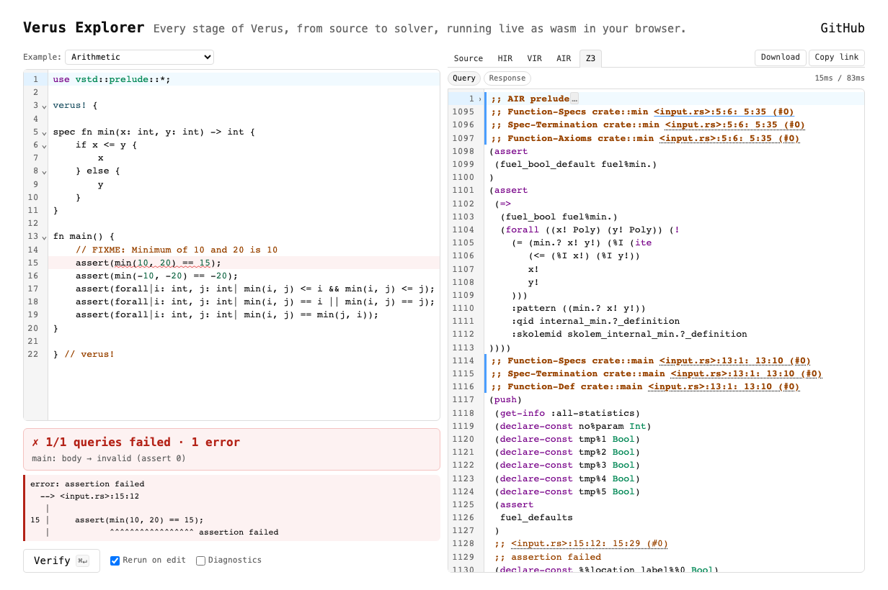

# verus-explorer

Browser-based explorer for the [Verus](https://verus-lang.github.io/verus/) verifier's internal pipeline. Paste Rust, see the verdict, and inspect every IR stage — rustc AST/HIR, Verus VIR/SST, AIR, SMT, Z3 responses — live in the page. No server, no install; everything runs in-browser via a patched rustc-in-wasm and a wasm build of Z3.

**[▶ Try it live](https://shawnzhong.github.io/verus-explorer/)** — no setup required.

<a href="https://shawnzhong.github.io/verus-explorer/">
  <picture>
    <source media="(prefers-color-scheme: dark)" srcset="docs/screenshot-dark.png">
    
  </picture>
</a>

## Quick start

```sh
make dev serve       # build into dist/, serve http://localhost:8000
```

Open the page, edit code on the left, and watch each stage update on the right. Auto-verify fires ~800ms after each keystroke; `Cmd+Enter` forces a run.

## What you see

| Tab        | What it is                                                |
|------------|-----------------------------------------------------------|
| Source     | Your editor (CodeMirror 6, Rust syntax, inline squiggles) |
| AST_PRE    | rustc AST before expansion                                |
| AST / HIR  | rustc AST after expansion, then HIR                       |
| VIR        | Verus VIR (the verifier's high-level IR)                  |
| SST_AST    | SST after AST→SST lowering                                |
| SST_POLY   | SST after polymorphism desugaring                         |
| AIR        | AIR trees (initial → middle → final, one per lowering)    |
| SMT        | SMT-LIB2 commands sent to Z3                              |
| Z3         | Z3's replies (`sat`/`unsat`/`unknown` + models + errors)  |
| Verdict    | Per-query pass/fail summary under the editor              |

Every item in VIR / SST / AIR / SMT carries a `;; <input.rs>:L:C` comment; click the span to jump the source editor to that position.

## Project layout

```
src/                    Explorer crate (wasm-bindgen entry, pipeline driver)
public/                 Static assets (HTML, CSS, example snippets)
scripts/editor/         CodeMirror 6 bundle entry (esbuild input)
scripts/screenshot/     Playwright hero-image generator
third_party/verus/      Verus source tree, patched for in-browser use
third_party/rust/       Patched rustc (built once via `make host-rust`)
rustc-rlibs/            Forces wasm32 rlibs for every rustc_* crate we link
tests/smoke.rs          Node-hosted pipeline smoke test
docs/                   architecture.md, overview.md, roadmap.md
Makefile                All build/serve/deploy targets
```

## Building from source

First-time setup is heavy because it compiles a patched rustc toolchain:

```sh
./setup.sh           # one-shot: clones submodules, builds host rustc + verus
make dev             # incremental build into dist/
```

## Useful make targets

```sh
make dev          # debug wasm into dist/
make release      # opt-level=z + wasm-opt -Oz (production bundle)
make serve        # dev + python3 http.server --directory dist/ 8000
make test         # wasm-bindgen Node-hosted smoke test
make deploy       # release + push dist/ to origin/gh-pages
make clean        # cargo / wasm-libs / wasm-z3 (keeps host-rust)
make clean-host   # nuke patched rustc + host verus (slow to rebuild)
```

## Further reading

- [`docs/overview.md`](docs/overview.md) — data flow through the pipeline
- [`docs/architecture.md`](docs/architecture.md) — per-component detail
- [`docs/roadmap.md`](docs/roadmap.md) — what's next
- [`AGENTS.md`](AGENTS.md) — contribution conventions

## Acknowledgments

- [Verus](https://github.com/verus-lang/verus) — the verifier whose pipeline this exposes; all of the VIR / SST / AIR machinery is theirs.
- [rustc](https://github.com/rust-lang/rust) — patched and compiled to wasm to run as an in-browser Rust frontend.
- [Z3](https://github.com/Z3Prover/z3) — compiled to wasm (via Emscripten) to serve as the in-browser SMT solver.
- [CodeMirror 6](https://codemirror.net/) — source and output editors.
