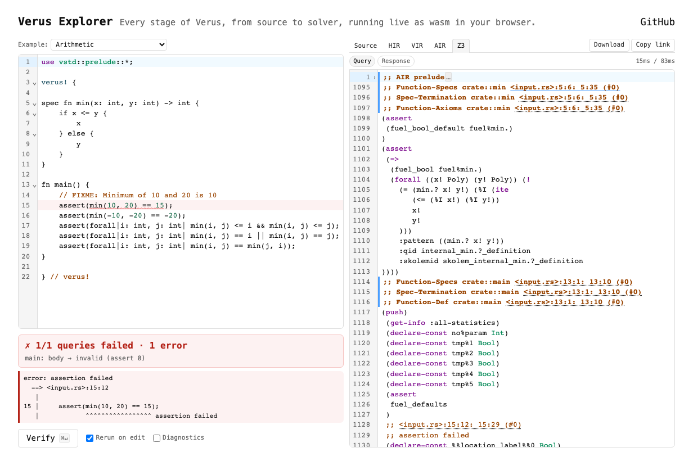

# verus-explorer

The full [Verus](https://verus-lang.github.io/verus/) pipeline running in-browser via wasm — no install, no backend. Pick an example, watch every IR from rustc AST through Z3 update live as you type. Aimed at learners, educators, people debugging or reviewing Verus proofs, and contributors poking at the verifier internals.

**[▶ Try it live](https://shawnzhong.github.io/verus-explorer/)** — no setup required.

<a href="https://shawnzhong.github.io/verus-explorer/">
  <picture>
    <source media="(prefers-color-scheme: dark)" srcset="public/screenshot-dark.png">
    
  </picture>
</a>

## Features

**Pipeline coverage.** Every IR stage is its own tab — rustc AST (parsed & expanded), rustc HIR (untyped & typed), Verus VIR/SST (incl. polymorphism-simplified), AIR (initial, SSA, flat), and SMT-LIB2 queries + Z3 responses. Plus a per-query pass/fail Verdict summary.

**Reading & debugging.** Every `<input.rs>:L:C` span in every IR tab is clickable and scrolls the source editor to the exact line. In AIR/SMT/Z3, each `Function-Def` / `Function-Specs` / `Function-Axioms` op gets its own collapsible block with a `;; <label> <span>` banner — vstd-crate items fold by default, local-crate items stay expanded. Rustc errors surface as inline squiggles on the source editor with hover tooltips and a diagnostics pane, same as `cargo verify`; an **Expand errors** toggle turns on Verus' sub-conjunct expansion so a failed compound assertion reports which specific piece broke.

**Editing & sharing.** Auto-verify ~500ms after each keystroke (toggleable); `Cmd+Enter` forces a run. Per-stage timings show in the subtab row so you can see which stage dominates. A dropdown preloads examples (arithmetic, loop invariants, recursion, requires/ensures, collections, structs with invariants). The URL hash encodes the current source (gzip + base64url) — share a link and someone else opens at the exact same state.

## Implementation

- [**Z3**](https://github.com/Z3Prover/z3/tree/z3-4.16.0) — unmodified source, compiled to wasm with Emscripten.
- [**rustc**](https://github.com/rust-lang/rust/compare/1.94.0...ShawnZhong:rust:main) — lightly patched for wasm32-host compilation and proc-macro registration.
- [**Verus**](https://github.com/verus-lang/verus/compare/release/0.2026.04.19.6f7d4de...ShawnZhong:verus:main) — small `pub` / `pub(crate)` exposures, plus a new `Verifier::build_bucket_preamble` helper shared between `verify_bucket` (native) and the explorer so the preamble stays lock-step. All IR construction (`vir` / `air` / `rust_verify`) runs upstream-as-is.
- [**verus-explorer (wasm crate)**](verus-explorer) — drives the pipeline inside the browser: its own `run_queries` driver for per-op log drainage, a custom `Reporter` that routes diagnostics through rustc's channels, and in-memory log writers in place of file-based ones. `verify_bucket` is monolithic with no per-op hooks, so we drive `OpGenerator` directly instead of calling it.
- [**verus-explorer (frontend)**](public) — the page itself: CodeMirror 6 source + output editors with custom syntax modes for each IR stage, tab/subtab navigation, fold-state management, span-link decorations, diagnostic rendering, and URL-hash share wiring.

## Project layout

```
verus-explorer/         Main crate (wasm-bindgen entry, pipeline driver)
rustc-rlibs/            Helper crate — forces wasm32 rlibs of every rustc_* crate
public/                 Static assets (HTML, CSS, example snippets)
scripts/editor/         CodeMirror 6 bundle entry (esbuild input)
scripts/screenshot/     Playwright hero-image generator
third_party/verus/      Verus source tree, patched for in-browser use
third_party/rust/       Patched rustc (built once via `make host-rust`)
Cargo.toml              Workspace manifest (members + shared profiles)
Makefile                All build/serve/deploy targets
```

## Building from source

First-time setup is heavy because it compiles a patched rustc toolchain:

```sh
./setup.sh           # one-shot: clones submodules, builds host rustc + verus
make dev             # incremental build into dist/
```

## Useful make targets

```sh
make dev          # debug wasm into dist/
make release      # opt-level=z + wasm-opt -Oz (production bundle)
make serve        # dev + python3 http.server --directory dist/ 8000
make test         # wasm-bindgen Node-hosted smoke test
make deploy       # release + push dist/ to origin/gh-pages
make clean        # cargo / wasm-libs / wasm-z3 (keeps host-rust)
make clean-host   # nuke patched rustc + host verus (slow to rebuild)
```

## Acknowledgments

- [Verus](https://github.com/verus-lang/verus) — the verifier whose pipeline this exposes; all of the VIR / SST / AIR machinery is theirs.
- [rustc](https://github.com/rust-lang/rust) — patched and compiled to wasm to run as an in-browser Rust frontend.
- [Z3](https://github.com/Z3Prover/z3) — compiled to wasm (via Emscripten) to serve as the in-browser SMT solver.
- [CodeMirror 6](https://codemirror.net/) — source and output editors.
